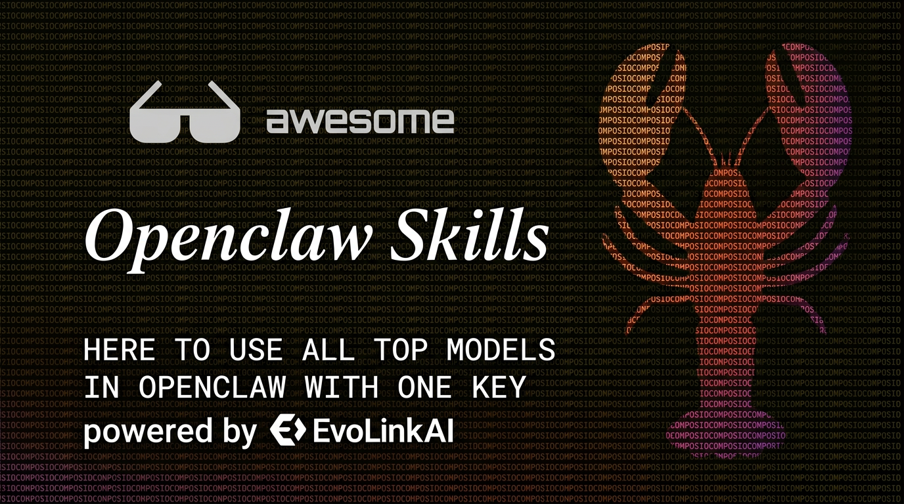
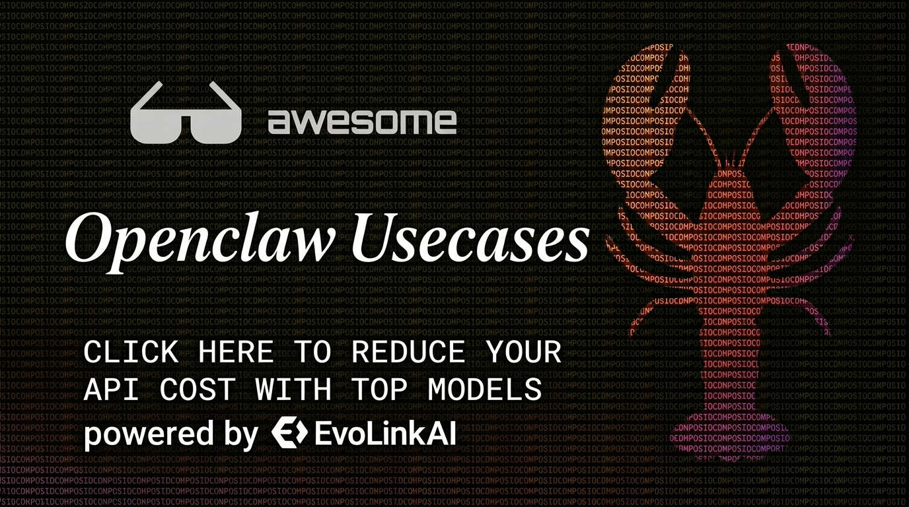

🌐 语言选择: [English](./README.md) | [简体中文](./README.zh-CN.md) | [繁體中文](./README.zh-TW.md) | [Español](./README.es.md) | [Deutsch](./README.de.md) | [Français](./README.fr.md) | [日本語](./README.ja.md) | [한국어](./README.ko.md) | [Türkçe](./README.tr.md) | [Русский](./README.ru.md)

[](https://evolink.ai/signup?utm_source=github&utm_medium=banner&utm_campaign=awesome-openclaw-skills)

# awesome-openclaw-skills-for-real-work 🐙

> **Quality over quantity.** This is not a mirror of every skill on ClawHub.
> It's a curated guide to skills that actually work in real workflows — tested, organized, and explained for humans.

[](https://awesome.re)
[](https://clawhub.com)
[](https://openclaw.ai)


---

## Philosophy

Most skill lists are just dumps. This one is different:

- ✅ **Every entry is hand-reviewed** — not just scraped from a registry
- ✅ **Full documentation included** — every skill has its own detailed usage guide in `./skills/`
- ✅ **Real-world utility first** — if it doesn't help you ship faster or think better, it's not here
- ✅ **Honest about limitations** — security flags and API key requirements are clearly marked
- ✅ **Built for stacking** — skills are most powerful in combinations (see [Starter Packs](#-starter-packs))

---

## Legend

| Badge | Meaning |
|-------|---------|
| 🆓 No API Key | Works out of the box — no external credentials needed |
| 🔑 API Key Required | Needs an external service key |
| ⚠️ Security Flagged | ClawHub security scan raised concerns — review before installing |
| ⭐ Stars | ClawHub community stars |
| 📖 Full Docs | Detailed documentation included in this repo |

---

## Table of Contents

- [🚀 Starter Packs](#-starter-packs)
- [🔍 Research & Search](#-research--search)
- [🤖 Browser & Automation](#-browser--automation)
- [🧠 Memory & Knowledge](#-memory--knowledge)
- [💬 Communication & Messaging](#-communication--messaging)
- [📊 Data & Documents](#-data--documents)
- [🛠️ Dev Tools](#️-dev-tools)
- [🎨 Creative & Media](#-creative--media)
- [💰 Finance & Markets](#-finance--markets)
- [🏠 Smart Home & System](#-smart-home--system)
- [🔒 Security](#-security)
- [⚡ Agent Core Capabilities](#-agent-core-capabilities)
- [All Skills Index](./skills/)
- [Contributing](#contributing)

---

[](https://evolink.ai/signup?utm_source=github&utm_medium=banner&utm_campaign=awesome-openclaw-skills)

## 🚀 Starter Packs

> New to OpenClaw? Don't install 50 skills. Start here.

### 🟢 Beginner Pack — "Get things done in 10 minutes"

The minimum viable agent setup. Zero API keys required.

| Skill | Docs | Why |
|-------|------|-----|
| [Memory Setup](./skills/memory-setup.md) 📖 | ✅ | Your agent remembers you between sessions |
| [Multi Search Engine](./skills/multi-search-engine.md) 📖 | ✅ | Web search without any key — the backbone |
| [Summarize](./skills/summarize.md) 📖 | ✅ | Read less, understand more |
| [Weather](./skills/weather.md) 📖 | ✅ | Quick useful demo of what agents can do |
| [Todoist](./skills/todoist.md) 📖 | ✅ | Task management that actually sticks |

---

### 🔵 Power User Pack — "Replace 5 apps with 1 agent"

For people who use their agent every day.

| Skill | Docs | Why |
|-------|------|-----|
| [Self-Improving + Proactive Agent](./skills/self-improving-agent.md) 📖 | ✅ | Agent learns your preferences permanently |
| [Deep Research Pro](./skills/deep-research-pro.md) 📖 | ✅ | Multi-source cited research reports |
| [Gmail](./skills/gmail.md) 📖 | ✅ | Email directly from chat |
| [Notion](./skills/notion.md) 📖 | ✅ | Write to your second brain |
| Agent Browser | ❌ | Control the web visually |
| [Filesystem Management](./skills/filesystem-management.md) 📖 | ✅ | Files and folders, hands-free |

---

### 🟠 Developer Pack — "Code, ship, repeat"

Built for engineers who want an AI pair programmer with real tools.

| Skill | Docs | Why |
|-------|------|-----|
| [Git Essentials](./skills/git-essentials.md) 📖 | ✅ | Commit, branch, diff — from chat |
| [Docker Essentials](./skills/docker-essentials.md) 📖 | ✅ | Container management without memorizing flags |
| [GitHub](./skills/github.md) 📖 | ✅ | Issues, PRs, repos — full control |
| [Tmux](./skills/tmux.md) 📖 | ✅ | Persistent terminal sessions |
| [Security Auditor](./skills/security-auditor.md) 📖 | ✅ | Catch issues before they ship |
| [n8n Workflow Automation](./skills/n8n-workflow-automation.md) 📖 | ✅ | Build automation pipelines with AI |

---

### 🟣 Researcher Pack — "Know more than everyone else in the room"

For analysts, writers, and anyone who makes decisions based on information.

| Skill | Docs | Why |
|-------|------|-----|
| [Deep Research Pro](./skills/deep-research-pro.md) 📖 | ✅ | Multi-source deep research with citations |
| [Brave Search](./skills/brave-search.md) 📖 | ✅ | Fast, private, real-time web results |
| Tavily 搜索 | ❌ | AI-optimized search results |
| [News Summary](./skills/news-summary.md) 📖 | ✅ | Daily briefing, automated |
| [Summarize](./skills/summarize.md) 📖 | ✅ | Long docs → key insights instantly |
| [Obsidian](./skills/obsidian.md) 📖 | ✅ | Save research directly to your vault |

---

### 🔴 Content Creator Pack — "Produce more, think less"

For marketers, social media managers, and writers.

| Skill | Docs | Why |
|-------|------|-----|
| [Humanize AI text](./skills/humanize-ai-text.md) 📖 | ✅ | Make AI writing sound human |
| SuperDesign | ❌ | UI/design specs and mockup descriptions |
| [OpenAI Image Gen](./skills/openai-image-gen.md) 📖 | ✅ | Generate images inline |
| [Markdown Converter](./skills/markdown-converter.md) 📖 | ✅ | Convert anything to/from Markdown |
| [YouTube Watcher](./skills/youtube-watcher.md) 📖 | ✅ | Research videos without watching them |
| Xiaohongshu Automation ⚠️ | ❌ | Xiaohongshu / 小红书 content workflow |

---

## 🔍 Research & Search

The foundation of any productive agent. Pick one primary search engine and add specialized ones.

| Skill | ⭐ | API Key | Docs | Description |
|-------|-----|---------|------|-------------|
| [Multi Search Engine](./skills/multi-search-engine.md) 📖 | 297 | 🆓 | ✅ | Combines multiple engines in one call — the best default search skill |
| [Brave Search](./skills/brave-search.md) 📖 | 149 | 🔑 | ✅ | Fast, private, reliable — excellent signal-to-noise ratio |
| [Deep Research Pro](./skills/deep-research-pro.md) 📖 | 45 | 🆓 | ✅ | Multi-source research with structured cited reports |
| [Exa Web Search (Free)](./skills/exa-web-search.md) 📖 | 57 | 🆓 | ✅ | Neural search — finds semantically relevant pages, not just keyword matches |
| Tavily 搜索 | 77 | 🔑 | ❌ | AI-native search API, great for research workflows |
| Tavily AI Search | 26 | 🔑 ⚠️ | ❌ | Alternative Tavily integration — review security scan before installing |
| DuckDuckGo Web Search | 10 | 🆓 | ❌ | Simple, privacy-first, no API key |
| [Searxng](./skills/searxng.md) 📖 | 22 | 🆓 | ✅ | Self-hosted meta-search — requires your own SearXNG instance |
| Baidu Web Search | 112 | 🔑 | ❌ | Chinese-language web search |
| [News Summary](./skills/news-summary.md) 📖 | 78 | 🆓 | ✅ | Automated daily news digest |
| Answer Overflow | 123 | 🆓 | ❌ | Searches Discord dev communities for technical answers |

> **Pick one:** Multi Search Engine (no key, broad) → Brave Search (best quality, needs key) → Exa (semantic, free tier)

---

## 🤖 Browser & Automation

Skills that let your agent actually *do* things on the web, not just look things up.

| Skill | ⭐ | API Key | Docs | Description |
|-------|-----|---------|------|-------------|
| Agent Browser | 64 | 🆓 | ❌ | Visual browser control — click, type, screenshot, scrape |
| Playwright MCP | 88 | 🆓 | ❌ | Playwright via MCP — precise browser automation |
| Playwright (Automation + MCP + Scraper) | 18 | 🆓 | ❌ | Full suite: automate, test, and scrape with Playwright |
| [Desktop Control](./skills/desktop-control.md) 📖 ⚠️ | 214 | 🆓 | ✅ | Mouse, keyboard, screen control — powerful but review security scan |
| Xiaohongshu Automation | 79 | 🆓 ⚠️ | ❌ | 小红书 content workflow via MCP |
| [YouTube Watcher](./skills/youtube-watcher.md) 📖 | 217 | 🆓 | ✅ | Extract transcripts, summaries, and insights from YouTube videos |
| [Camsnap](./skills/camsnap.md) 📖 | 7 | 🆓 | ✅ | Take camera snapshots on macOS |
| Video Frames | 79 | 🆓 | ❌ | Extract frames from local video files for analysis |
| [n8n Workflow Automation](./skills/n8n-workflow-automation.md) 📖 | 88 | 🆓 | ✅ | Trigger and manage n8n workflows from your agent |
| [Browser Use](./skills/browser-use.md) 📖 ⚠️ | 65 | 🆓 | ✅ | Browser automation — security flagged, review before using |

> ⚠️ **Note on Playwright Scraper Skill** (⭐38): flagged — use Playwright MCP instead.

---

## 🧠 Memory & Knowledge

Without memory, your agent resets every session. These skills make it persistent.

| Skill | ⭐ | API Key | Docs | Description |
|-------|-----|---------|------|-------------|
| [Memory Setup](./skills/memory-setup.md) 📖 | 83 | 🆓* | ✅ | The foundation — configures MEMORY.md and vector search. **Start here.** |
| [Self-Improving + Proactive Agent](./skills/self-improving-agent.md) 📖 | 384 | 🆓 | ✅ | Agent learns from corrections and self-reflects permanently |
| [Memory Manager](./skills/memory-manager.md) 📖 | 68 | 🆓* | ✅ | Active memory CRUD — search, update, delete specific memories |
| Agent Memory | 14 | 🆓 | ❌ | Lightweight memory layer for smaller setups |
| Elite Longterm Memory | 131 | 🔑 ⚠️ | ❌ | Advanced multi-tier memory — review security scan first |
| [Obsidian](./skills/obsidian.md) 📖 | 205 | 🆓 | ✅ | Write and read from your Obsidian vault — knowledge base integration |
| [Notion](./skills/notion.md) 📖 | 188 | 🔑 | ✅ | Notion as your agent's external memory and workspace |
| Session-logs | 15 | 🆓 | ❌ | Auto-log sessions for later review and recall |
| Ontology | 288 | 🆓 | ❌ | Structured knowledge graph — build a semantic map of your domain |

> *May require optional API key for vector embedding (Voyage/OpenAI). Local provider available — no key needed.
>
> **Recommended stack:** Memory Setup → Self-Improving Agent → Memory Manager

---

## 💬 Communication & Messaging

Your agent as a communication hub — email, team chat, tasks, all in one place.

| Skill | ⭐ | API Key | Docs | Description |
|-------|-----|---------|------|-------------|
| [Gmail](./skills/gmail.md) 📖 | 60 | 🔑 | ✅ | Read, compose, send Gmail — full email management |
| AgentMail | 45 | 🔑 | ❌ | Email agent with scheduling and follow-up tracking |
| [imap-smtp-email](./skills/imap-smtp-email.md) 📖 | 56 | 🔑 | ✅ | Universal email via IMAP/SMTP — works with any provider |
| Himalaya | 50 | 🆓 | ❌ | Terminal-based email client integration |
| [Slack](./skills/slack.md) 📖 | 91 | 🔑 | ✅ | Send and read Slack messages, manage channels |
| [Discord](./skills/discord.md) 📖 | 48 | 🔑 | ✅ | Discord integration — messages, channels, server management |
| Telegram | 17 | 🔑 | ❌ | Send Telegram messages from your agent |
| Imsg | 16 | 🆓 | ❌ | iMessage integration on macOS |
| [Apple Reminders](./skills/apple-reminders.md) 📖 | 39 | 🆓 | ✅ | Create and manage Apple Reminders — native macOS/iOS sync |
| [Todoist](./skills/todoist.md) 📖 | 43 | 🔑 | ✅ | Full Todoist integration — tasks, projects, priorities |
| Trello | 106 | 🔑 | ❌ | Trello board management from chat |
| [Caldav Calendar](./skills/caldav-calendar.md) 📖 | 173 | 🔑 | ✅ | Calendar access via CalDAV — works with iCloud, Fastmail, Nextcloud |

> **Email:** imap-smtp for universal compatibility; Gmail if you're Google-only
> **Tasks:** Todoist for power users; Apple Reminders if you live in Apple ecosystem

---

## 📊 Data & Documents

Read, write, convert, and analyze documents without leaving your chat.

| Skill | ⭐ | API Key | Docs | Description |
|-------|-----|---------|------|-------------|
| [Summarize](./skills/summarize.md) 📖 | 634 | 🆓 | ✅ | Summarize any text, URL, or document — one of the most-starred skills |
| [Data Analyst](./skills/data-analyst.md) 📖 | 51 | 🆓 | ✅ | Analyze datasets, generate insights, create charts |
| Data Analysis | 29 | 🆓 | ❌ | Structured data analysis workflows with code execution |
| [Excel / XLSX](./skills/excel-xlsx.md) 📖 | 40 | 🆓 | ✅ | Read, write, and manipulate Excel files |
| [Word / DOCX](./skills/word-docx.md) 📖 | 62 | 🆓 | ✅ | Create and edit Word documents |
| [Nano PDF](./skills/nano-pdf.md) 📖 | 147 | 🆓 | ✅ | Lightweight PDF reader — fast extraction without heavy deps |
| [Markdown Converter](./skills/markdown-converter.md) 📖 | 115 | 🆓 | ✅ | Convert HTML, DOCX, PDF → Markdown and back |
| [Humanize AI text](./skills/humanize-ai-text.md) 📖 | 144 | 🆓 | ✅ | Rewrite AI-generated content to sound natural |
| Qmd | 75 | 🆓 | ❌ | Quarto Markdown documents — academic and technical publishing |

> ⚠️ **Note on PDF** (⭐30, `awspace/pdf`): flagged — use Nano PDF instead.

---

## 🛠️ Dev Tools

Skills for engineers. These assume you know what you're doing.

| Skill | ⭐ | API Key | Docs | Description |
|-------|-----|---------|------|-------------|
| [GitHub](./skills/github.md) 📖 | 373 | 🔑 | ✅ | Issues, PRs, repos — full GitHub API access |
| [Git Essentials](./skills/git-essentials.md) 📖 | 23 | 🆓 | ✅ | Commit, branch, merge, diff from chat |
| [Docker Essentials](./skills/docker-essentials.md) 📖 | 21 | 🆓 | ✅ | Container management — list, start, stop, logs |
| [Tmux](./skills/tmux.md) 📖 | 31 | 🆓 | ✅ | Persistent terminal sessions — survives disconnects |
| [Filesystem Management](./skills/filesystem-management.md) 📖 | 60 | 🆓 | ✅ | Safe file and folder operations with guardrails |
| [API Gateway](./skills/api-gateway.md) 📖 | 223 | 🔑 | ✅ | Connect to 100+ APIs (Google, Microsoft, GitHub, Notion, Airtable) with managed OAuth |
| [n8n Workflow Automation](./skills/n8n-workflow-automation.md) 📖 | 88 | 🆓 | ✅ | Build and trigger n8n workflows — no-code automation pipelines |
| [Mcporter](./skills/mcporter.md) 📖 | 114 | 🆓 | ✅ | MCP server porting and management |
| [Nano Banana Pro](./skills/nano-banana-pro.md) 📖 | 206 | 🆓 | ✅ | Swiss-army knife for terminal tasks — highly opinionated |
| [OpenClaw Backup](./skills/openclaw-backup.md) 📖 | 43 | 🆓 | ✅ | Backup your OpenClaw config and workspace |
| [Model Usage](./skills/model-usage.md) 📖 | 88 | 🆓 | ✅ | Track token usage and model costs across sessions |
| [Auto-Updater Skill](./skills/auto-updater.md) 📖 | 280 | 🆓 | ✅ | Keep your installed skills in sync automatically |
| Clawdbot Documentation Expert | 256 | 🆓 | ❌ | Answers OpenClaw/Clawdbot questions from official docs |

---

## 🎨 Creative & Media

For when the output is something humans will look at, listen to, or watch.

| Skill | ⭐ | API Key | Docs | Description |
|-------|-----|---------|------|-------------|
| SuperDesign | 119 | 🆓 | ❌ | UI/UX design specs, component descriptions, design system guidance |
| UI/UX Pro Max | 86 | 🆓 | ❌ | Advanced design critique, accessibility, and prototype specs |
| [OpenAI Image Gen](./skills/openai-image-gen.md) 📖 | 24 | 🔑 | ✅ | Generate images via DALL-E inline in chat |
| [Edge TTS](./skills/edge-tts.md) 📖 | 22 | 🆓 | ✅ | Text-to-speech using Microsoft Edge voices — free, high quality |
| [OpenAI Whisper](./skills/openai-whisper.md) 📖 | 213 | 🔑 | ✅ | Transcribe audio files using Whisper API |
| OpenAI Whisper API | 31 | 🔑 | ❌ | Lightweight Whisper API wrapper |
| [YouTube Watcher](./skills/youtube-watcher.md) 📖 | 217 | 🆓 | ✅ | Extract and summarize YouTube content |
| Video Frames | 79 | 🆓 | ❌ | Frame extraction for video analysis |
| Gifgrep | 6 | 🆓 | ❌ | Search and download GIFs — lightweight fun |
| Spotify Player | 35 | 🔑 | ❌ | Control Spotify playback from chat |
| Sonoscli | 40 | 🆓 | ❌ | Control Sonos speakers via CLI |

---

## 💰 Finance & Markets

Market data, portfolio monitoring, and financial research. Always verify with your own sources.

| Skill | ⭐ | API Key | Docs | Description |
|-------|-----|---------|------|-------------|
| Stock Market Pro | 131 | 🆓* | ❌ | Comprehensive market data, screener, and portfolio analysis |
| Stock Watcher | 60 | 🆓 | ❌ | Monitor stock prices and get alerts |
| [ByteRover](./skills/byterover.md) 📖 | 98 | 🆓 | ✅ | Financial data aggregation and analysis |

> ⚠️ **Note on Stock Analysis** (⭐161): flagged by security scan — not included here. Use Stock Market Pro instead.
>
> *Free tier available; some features may require a data provider key.

---

## 🏠 Smart Home & System

For the people who want their agent to control their physical environment.

| Skill | ⭐ | API Key | Docs | Description |
|-------|-----|---------|------|-------------|
| [Home Assistant](./skills/home-assistant.md) 📖 | 36 | 🔑 | ✅ | Full Home Assistant integration — devices, automations, scenes |
| [Weather](./skills/weather.md) 📖 | 294 | 🆓 | ✅ | Current weather and forecasts — no API key, works everywhere |
| [GoPlaces](./skills/goplaces.md) 📖 | 26 | 🆓 | ✅ | Location-aware place search and navigation |
| [Apple Notes](./skills/apple-notes.md) 📖 | 40 | 🆓 | ✅ | Read and write Apple Notes on macOS |
| [1Password](./skills/1password.md) 📖 | 34 | 🆓 | ✅ | Access 1Password vault items — read-only, secure |
| [Peekaboo](./skills/peekaboo.md) 📖 | 51 | 🆓 | ✅ | macOS vision tool — see what's on your screen |
| [Gog](./skills/gog.md) 📖 | 741 | 🆓 | ✅ | GOG game launcher and library management |

---

## 🔒 Security

Audit, harden, and protect. Don't skip this section.

| Skill | ⭐ | API Key | Docs | Description |
|-------|-----|---------|------|-------------|
| [Security Auditor](./skills/security-auditor.md) 📖 | 19 | 🆓* | ✅ | Automated security review for code and configs — catches common vulnerabilities |
| [healthcheck](./skills/healthcheck.md) 📖 ⚠️ | 8 | 🆓 | ✅ | System health and security hardening — review scan before installing |
| Skill Vetter | 427 | 🆓 | ❌ | Vet any skill before installing — analyzes SKILL.md for risks |

> **Pro tip:** Install Skill Vetter first. Then use it to evaluate everything else on this list.

---

## ⚡ Agent Core Capabilities

These skills change *how* your agent thinks and acts. They're multipliers for everything else.

| Skill | ⭐ | API Key | Docs | Description |
|-------|-----|---------|------|-------------|
| [Self-Improving + Proactive Agent](./skills/self-improving-agent.md) 📖 | 384 | 🆓 | ✅ | **The most important skill here.** Agent learns from you permanently, self-reflects, and improves over time |
| [Proactive Agent](./skills/proactive-agent.md) 📖 | 557 | 🆓 | ✅ | Agent initiates actions without being asked — monitors and responds proactively |
| Proactive Agent Lite | 21 | 🆓 | ❌ | Lighter version of Proactive Agent — lower resource footprint |
| [Find Skills](./skills/find-skills.md) 📖 | 899 | 🆓 | ✅ | **Most starred skill on ClawHub.** Searches and installs skills from within your agent |
| [Summarize](./skills/summarize.md) 📖 | 634 | 🆓 | ✅ | Core utility — appears in almost every workflow |
| [Auto-Updater Skill](./skills/auto-updater.md) 📖 | 280 | 🆓 | ✅ | Keeps all skills up to date automatically |
| [Free Ride](./skills/free-ride.md) 📖 | 274 | 🆓 | ✅ | Route tasks to free AI tiers intelligently — reduce costs |
| [Gemini](./skills/gemini.md) 📖 | 44 | 🔑 | ✅ | Add Google Gemini as a model option |
| Skill Creator | 150 | 🆓 ⚠️ | ❌ | Create new skills from within your agent — review scan first |
| [Evolver](./skills/evolver.md) 📖 ⚠️ | 66 | 🆓 | ✅ | Agent self-evolves its own capabilities — experimental, review scan |

> ⚠️ **Note on Evolver:** flagged by security scan across multiple versions. Treat as experimental.

---

## What's Not Here (and Why)

Some skills from ClawHub were deliberately excluded or marked as high-risk:

| Skill | Reason |
|-------|--------|
| [Browser Use](./skills/browser-use.md) | Security flagged — suspicious patterns, included but marked high risk |
| [Desktop Control](./skills/desktop-control.md) | Security flagged — included but marked high risk |
| Stock Analysis | Security flagged |
| Agent Browser (TheSethRose) | Security flagged |
| Elite Longterm Memory | Security flagged |
| Playwright Scraper Skill | Security flagged |
| Web Search (billyutw) | Security flagged |
| Duplicate entries | Apple Reminders ×4, Brave Search ×2, Evolver ×3, Baidu Search ×2 — merged into single entries |

This doesn't mean those skills are malicious — ClawHub security scans can produce false positives. It means you should **review the scan report before installing**.

---

## Contributing

Found a skill that deserves to be here? Open a PR.

**Requirements to add a skill:**
1. Must be on ClawHub with a working install link
2. Must solve a real workflow problem (not just a demo)
3. Must pass the "would I use this weekly?" test
4. Security flagged skills require explicit documentation of the risk
5. Must include full documentation in `./skills/` following the existing template

**PR format for README updates:**
```markdown
| [Skill Name](./skills/skill-name.md) 📖 | ⭐ stars | 🆓/🔑 | ✅ | One-line description |
```

---

## License

CC0 — public domain. Use freely.

---

*Last updated: March 2026 | Skills sourced from [ClawHub](https://clawhub.com) | Runtime: [OpenClaw](https://openclaw.ai)*